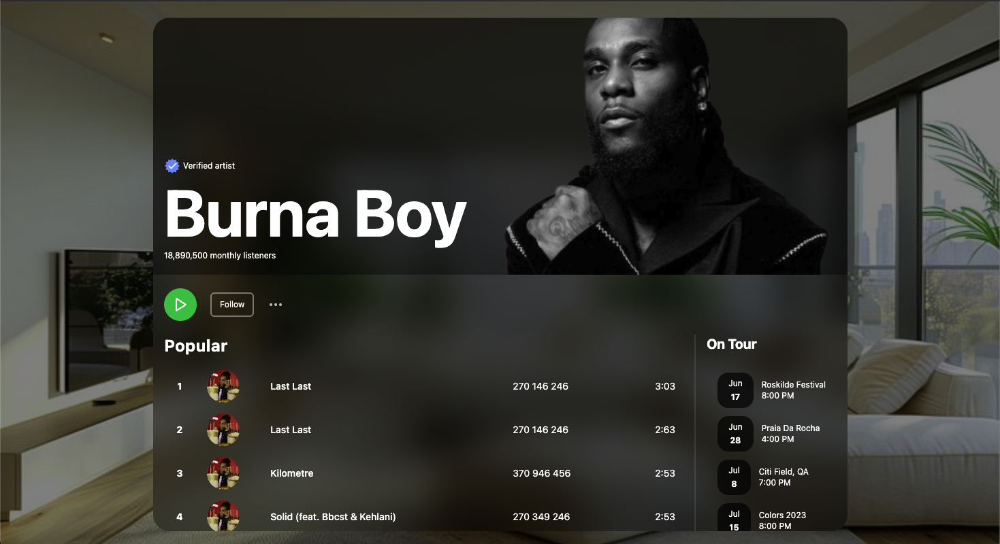

# Spotify Spatial UI - Apple Vision Pro Recreation

This project is a recreation of the Spotify Spatial UI concept designed for Apple Vision Pro, originally showcased on Dribbble by Sam Alfaro of Won Agency. It focuses on rebuilding the middle section of the design to explore spatial UI principles.

[**click here to view the live preview**](https://spotify-spatial-ui-interface-burnaboy.netlify.app/)

## [Spotify Spatial UI concept designed for Apple Vision Pro]

## Credits

*   [Original Design](https://dribbble.com/shots/21703163-Spotify-Spatial-UI-Interface-Apple-Vision-Pro) by [Sam Alfaro](https://dribbble.com/owsm) 🇸🇪 Founder of [Won Agency](https://won.agency/)
*   [Recreation](https://github.com/goddi199) by [youtube.com/@willfrd](https://www.youtube.com/@willfrd)

## Built With

*   [React](https://react.dev/) - A JavaScript library for building user interfaces
*   [GSAP (GreenSock Animation Platform)](https://greensock.com/) - For smooth and performant animations.
*   [Lucide React](https://lucide.dev/) - Beautifully simple, pixel-perfect icons.
*   [Heroicons React](https://heroicons.com/) - A set of free MIT-licensed high-quality SVG icons for UI development.

